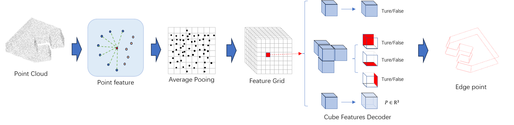

# SANVE-Net

PyTorch implementation for the paper **"基于结构感知增强的三维点云轮廓提取方法"** (Structure Aware-enhanced Neural Volumetric Edge Network for 3D Point Cloud Contour Extraction).



## Introduction

SANVE-Net（Structure Aware-enhanced Neural Volumetric Edge Network）是一种基于结构感知增强的神经体素边缘学习网络，面向三维点云轮廓精细化提取任务。该方法从邻域构建与几何关系表达两个层面协同优化：

- **动态邻域重构（Dynamic Neighborhood Reconstruction, DN）**：在特征空间中基于余弦相似度重构局部邻域关系，使邻域构建由欧氏距离驱动转变为结构相似性驱动，有效缓解复杂结构区域的邻域污染问题。
- **EdgeConv 显式关系建模（EdgeConv, EC）**：引入 EdgeConv 算子对点间相对差分特征进行显式建模，增强网络对局部拓扑结构与几何细节的表达能力。
- **神经体素边缘表示（Neural Volumetric Edge Representation）**：将 3D 结构化边缘编码为体素级的占据状态、方向信息及边缘点位置，实现结构化轮廓预测。

在 ABC 数据集上的试验结果表明，与基线方法 NerVE 相比，Chamfer Distance 与 Boundary Hausdorff Distance 分别降低约 **11%** 与 **4%**，Precision、Recall 和 IoU 分别达到 **94.85%**、**85.34%** 与 **83.99%**。

## Requirements

Install from requirements.txt:

```
pip install -r requirements.txt
```

Build the avg_pooling module. **NOTE:** the CUDA version of your installed `PyTorch` has to be consistent with the version of your `nvcc`.

```
cd network/avg_pooling
python setup.py build_ext
python setup.py install
```

**Environment:**
- Python 3.9.21
- PyTorch 2.3.0
- CUDA 11.8

**Hardware:**
- Dual AMD EPYC 7542 32-Core Processor, 2.9 GHz
- 512 GB RAM
- 8 × GeForce RTX 4090

## Network Architecture

SANVE-Net 整体采用编码器—解码器架构，由点云特征编码模块、体素空间编码模块及多分支解码模块三部分组成。


### Neural Volumetric Edge Representation

体素化表示将连续三维曲线离散为规则体积网格，每个立方体包含三个属性：
1. **边缘占据率 o**：定义立方体是否包含边缘
2. **边方向 e**：表示立方体是否应与其相邻立方体连接（定义左、下、背面三个方向）
3. **边缘点位置 p**：定义立方体中的边缘点坐标

### Dynamic Neighborhood Reconstruction

<!-- 【TODO: 在此插入图2 传统KNN与动态KNN邻域构建对比图】 -->

> **图2** &emsp; 传统KNN与动态KNN邻域构建对比。(a) 传统KNN基于欧氏距离选取最近邻，在两面相交区域（轮廓线附近）容易引入结构不相关的点（邻域污染）；(b) 动态KNN基于特征空间中的余弦相似度选取邻域点，能够更准确地反映结构关联性，避免邻域污染。

传统 PointNet++ 依赖欧氏距离构建固定 KNN 邻域，但在复杂结构场景中（如尖锐边界、曲面交界及高曲率区域），空间邻近性并不等价于结构相关性。本文在特征空间中基于余弦相似度动态重构局部邻域关系，选取结构最相似的前 K 个点作为新邻域。

<!-- 【TODO: 在此插入公式(1)图片】 -->

### EdgeConv Feature Aggregation

<!-- 【TODO: 在此插入图3 EdgeConv与Max-Pooling聚合流程对比图】 -->

> **图3** &emsp; Max-Pooling（上半）与EdgeConv（下半）算子聚合流程对比。Max-Pooling对邻域特征进行无差别融合，忽略点间几何关系；EdgeConv通过学习中心点与邻域点之间的相对差分特征，显式建模局部几何变化，有效增强边界区域的特征表达能力。

EdgeConv 将中心点特征与邻域差分特征拼接后输入共享 MLP，使网络能够联合感知中心点自身属性与邻域内的相对几何变化：

<!-- 【TODO: 在此插入公式(2)图片】 -->

### Encoder

<!-- 【TODO: 在此插入图4 编码器结构图】 -->

> **图4** &emsp; 编码器结构。输入点云经PointNet++提取逐点特征后，通过动态KNN重构邻域关系，经EdgeConv进行显式关系建模与特征聚合，再通过平均池化映射至体素空间，最后由3D CNN进一步编码体素空间上下文信息。

编码器由点特征提取模块与体素空间编码模块组成：
1. 利用轻量化 PointNet++ 提取逐点局部特征
2. 通过动态邻域重构获取特征空间中的近邻
3. 通过 EdgeConv 算子对点间关系显式建模并聚合特征
4. 经四层 MLP 及 Leaky ReLU 生成 128 维逐点特征
5. 平均池化映射至体素空间后，由轻量化 3D CNN（3层，卷积核大小为3、步长为1、填充为1）进一步编码体素上下文信息

### Decoder

<!-- 【TODO: 在此插入图5 三分支解码器结构图】 -->

> **图5** &emsp; 三个分支（o, e, p）体素特征解码器。编码器提取的体素特征分别输入占据预测、连接关系预测和边缘点位置回归三个并行分支。

解码器采用多分支预测结构，由五层 MLP 构成（除最后一层外每层后接 Leaky ReLU），分别预测：
- 边缘占据率 **o**（分类）
- 边缘连接方向 **e**（分类）
- 边缘点位置 **p**（回归）

<!-- 【TODO: 在此插入公式(3)图片，学习函数】 -->

### Loss Functions and Training Strategy

为缓解边缘体素与非边缘体素之间严重的数据不平衡问题，使用三个掩码分别学习每个立方体的属性：

<!-- 【TODO: 在此插入公式(4)(5)(6)图片，损失函数】 -->

- 边缘占据率 o 和边缘方向 e：**二值交叉熵（BCE）损失**
- 边缘点位置 p：**L1 损失**

训练时，先对所有立方体训练边缘占据率，再以真实边缘立方体为掩码学习边缘方向和边缘点位置。推断时，使用推断的边缘占据率作为掩码预测边缘方向和边缘点。

## Dataset and Training

### Dataset

本研究使用 [ABC 数据集](https://deep-geometry.github.io/abc-dataset/) 进行训练和测试。使用第一个组块（chunk），经筛选后包含 **2364 个模型**，随机拆分为训练集（80%）和测试集（20%）。

**数据预处理：**
- 从 ABC 数据集中提取 obj 文件中的点云作为输入，对点云进行归一化处理（归一化至 [-1, 1]³）
- 根据对应的 STEP 与 FEAT 文件生成轮廓真值，并转换为神经体素边缘表示
- 为每个点预先计算 K 最近邻以提供初始局部几何上下文信息

<!-- 【TODO: 替换为实际的下载链接】 -->
A ready-to-use dataset can be downloaded:
- [NerVE64Dataset.zip](https://drive.google.com/file/d/15t7lh1NhyZ1n1w8vhxQvJsFTRMkReK1U/view?usp=sharing)

Note: this dataset is for NerVE grid of resolution 64³. For preparing your own dataset, check `utils/prepare_data`.

### Training

```bash
python train_net.py -c /path/to/your/config.yaml
```

**Training Configuration:**
- NerVE grid resolution: 64³
- Input point cloud normalized to: [-1, 1]³
- Epochs: 60
- Optimizer: Adam
- Initial learning rate: 5×10⁻⁴
- Batch size: 1
- Training is split into three separate programs for o, e, p on three GPUs respectively

Example config files can be found in `exp/template`. Change `root_path` and `root of dataset` in the config file before training. Three config files (`cube.yaml`, `face.yaml`, `geom.yaml`) are provided for a complete SANVE-Net model.

### Evaluation

To evaluate the predicted curves, use functions from `utils/pwl2CAD/eval_cad_curve.py` to calculate:

| Metric | Description |
|:---:|:---|
| CD (Chamfer Distance) | 整体点分布误差 |
| BHD (Boundary Hausdorff Distance) | 边缘豪斯多夫距离，对边界极值误差敏感 |
| Precision | 精确度 |
| Recall | 召回率 |
| IoU | 交并比 |

## Acknowledgements

This codebase is built upon [NerVE](https://github.com/uhzoaix/NerVE). We thank the authors for releasing their code.